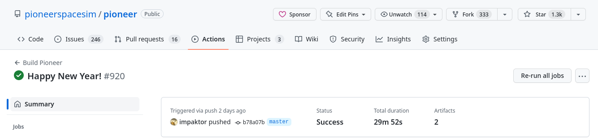

# Getting Started

To begin contributing to Pioneer directly, you'll most likely need a development copy of the game available on your system. The `master` branch is usually quite different from the version distributed in the latest release as bugfixes and new features are made.

## Getting the Code

Pioneer's primary repository is hosted at https://github.com/pioneerspacesim/pioneer. To do any hacking you need your own clone of the repository. We recommend that you host your own repository on Github by forking the primary repository as we make heavy use of Github's features, but in the finest git tradition you're welcome to manage your copy of the code as you please.

To get a copy of the code, you'll need to **clone** the repository locally:

```sh
git clone https://github.com/pioneerspacesim/pioneer.git
```

The Pioneer repository is very large, containing over 20,000 commits as well as many medium-to-large binary assets. To speed up the initial download of the repository, you can try using the [partial-clone](https://git-scm.com/docs/partial-clone) features and limiting the number of commits download from the repo using the `--depth=N` option:

```sh
git clone --filter=blob:limit=1m --depth=1 https://github.com/pioneerspacesim/pioneer.git
```

This will get you on the "master" branch, which is where new code is merged. This is the latest and greatest development version of Pioneer. The "master" branch is usually stable, though no guarantee is made that it will remain save-compatible with the previous release version.

You may also need to clone the [pioneer-thirdparty](https://github.com/pioneerspacesim/pioneer-thirdparty) repository, depending on what platform you're on. It is needed to build on Windows. You should clone this in a directory *next to* your clone of the pioneer directory (*not* a sub-directory). Further instructions on using `pioneer-thirdparty` are in the [COMPILING.txt](https://github.com/pioneerspacesim/pioneer/blob/master/COMPILING.txt) file.

More information is available in [Using Git and Github](./git-and-github), including instructions on how to upload your changes to your fork of the Pioneer repository.

## Making Changes

You'll want to make a feature branch for the changes you intend to make. Pick a short, concise name for the branch, then run this command:

```sh
git switch -c <your-branch-name>
```

To switch between branches, simply run `git switch` with the branch name in question. For example, to get back to the `master` branch, you'll want to run:

```sh
git switch master
```

Once you're on the feature branch, it's time to hack hack hack! This is the fun bit! It's recommended you stay in close contact with the other developers, either via IRC, a WIP Pull Request or the Dev forum, to make sure that your work fits with the rest of the project.

### Licensing

When making a contribution to the game, you'll need to keep in mind that Engine and Lua code is licensed under [GPL v3](http://www.gnu.org/licenses/gpl.html).
Assets (including Lua-based data files like custom systems) are licensed under [CC-BY-SA 3.0](http://creativecommons.org/licenses/by-sa/3.0/).

Opening a pull request or otherwise submitting code and assets is understood to be an agreement to provide said code/assets under the terms of the project's applicable licenses.

### Code Editing

Most development of Pioneer is done on Linux machines, and thus a number of the utility scripts developed for Pioneer are designed to run primarily on Linux and Unix-style systems. We do encourage development on Windows as well, but have very few contributors who maintain the Windows tooling.

Pioneer has several coding conventions we expect contributions to follow, as well as a general code structure informed by the design of the game's API and object models. More information is available in the [Coding Conventions](./coding-conventions) section.

### Compiling

There are instructions for how to compile the code included in the repository:

[COMPILING.txt](https://github.com/pioneerspacesim/pioneer/blob/master/COMPILING.txt)

Also available: [Compiling](Compiling)

### Debugging

For developers on Linux, gdb can be used for debugging

`gdb ./build/pioneer`
`run`

This starts pioneer in gdb. After a crash, you can get a back trace by typing into the gdb prompt "bt". Bugs, and feature requests, should be logged on the issue tracker.

### Misc.

[How to learn a codebase](https://www.samueltaylor.org/articles/how-to-learn-a-codebase.html)

## Adding Content

::: info TODO:
Short introduction to adding models / ships / systems, with links to appropriate pages
:::

## Requesting a Merge

Once your code is ready you need to request that it be merged. If you're using Github, the standard mechanism is a Pull Request. This creates an entry in the issue tracker so your request doesn't get lost. If you're not using Github you should manually create an issue, point to a place where your repository can be accessed and the commit hash of the branch head you want merged. We prefer the commit hash (e.g. `ec1354fe`) over the symbolic ref ("latest commit on my branch") so we can be sure that we're reviewing the same code.

We generally ask that new contributors open a Pull Request once they have finished the initial implementation of a feature or change. Your changes don't have to be 100% complete to open a Pull Request, but we ask that when you do so, it is with the intention to take reviewer feedback into account and commit to making the changes necessary to finish the feature or content you're contributing.

For more details about the specifics of opening Pull Requests, see [Using Git and Github](./git-and-github)

### Code Review

Once you've requested a merge someone will review your code or contribution. This is the most important part of the process. We insist on a review for two reasons:

-   Ensuring that the codebase remains consistent and there are no glaringly obvious bugs or structural defects in your code
-   Giving the reviewer an opportunity to learn your code and the parts of the codebase you changed

For small changes the review will often be a quick nod from someone in IRC, possibly even the merge manager doing the review at the same time as the merge. Larger changes will require a more thorough review, possibly by more than one person (if an expert in a particular area is required).

When the review is completed the reviewer should make a note on the relevant issue to indicate the branch is ready for merge.

If the change does not pass review then the reviewer should note the problems in the issue. You should go back and fix the things that the reviewer flagged as problems and then update the issue/pull request with the new code. The original reviewer should take the lead on follow-up reviews to make sure that all the original problems are addressed.

### Merge

Once the review is complete the merge manager will complete the merge and push an updated master. Congratulations, your code is now a part of Pioneer!

## Release Process

Once upon a time, Pioneer was released as alphas with freezing period. This changed after Alpha 33.

Every time code is merged to the `master` branch of the Pioneer repo, an automated CI process builds the game for Windows and Linux and attaches the packaged results ("artifacts") to the CI workflow run under the Actions tab. These artifacts are archived for at least a month and will be available to any logged-in Github user.



The Pioneer team generally commits to making a "full release" at least once a year on Pioneer Day - February 3rd. The latest release will always be linked from [the website](https://pioneerspacesim.net/). Version numbers for releases are formatted like `YYYYMMDD`, so a build for today might be `pioneer-20170827`. We generally try to focus on bugfixes for 1-2 weeks prior to Pioneer day to ensure there are no major issues present in the new release.

If there are changes that warrant it, new things, fixes, then a complete build for Windows and Linux will be run and uploaded as a pre-release. We also sometimes create release-candidate builds before Pioneer Day to aid in bug-hunting.

> Geraldine also archives a windows build once a month on moddb. <badge type="warning">Is this still accurate?</badge>

> To keep the changes visible, the changelog for the last month is visible on the main page, the G+, Twitter. The full changelog can be found on github. <badge type="warning">Is this still accurate?</badge>

Of course, the current changelog will always be available from the homepage and in the release archives proper.

This should mean that if you encounter a bug, the fix is available to you in an official, supported build as soon as possible.

For contributors "blessed" with the responsibility of making releases, see [Making a Release](./making-a-release.md) for more details.
