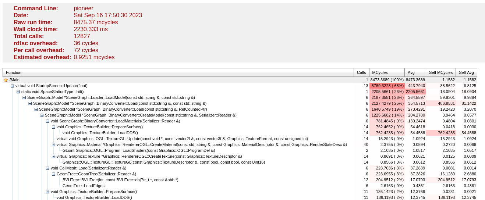
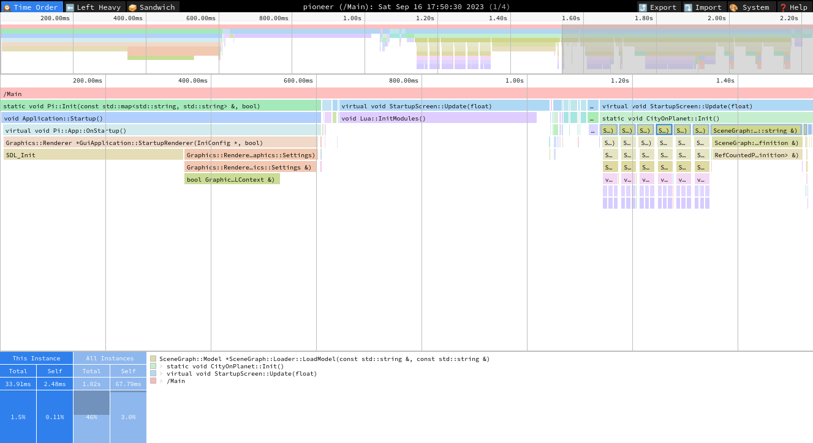

# Profiling

Pioneer supports several methods to measure the game's performance and identify sections of code which are in need of optimization. This process is colloquially called "profiling" and involves several steps:

1. Build the game with the profile collection functionality enabled;
2. Export frame profile captures while running the game;
3. Inspect the captures in a profile visualization tool;
4. ~~Spend time staring at the screen and frowning~~ identify hotspots and potential optimizations.

We'll cover how to do the first three in this section. The fourth is beyond the scope of this guide, and is a skill heavily related to a programmer's familiarity with the programming languages and architecture of Pioneer's code.

## Build with profiling support

Pioneer has a top-level CMake option controlling whether the profiler is compiled into the game, `PROFILER_ENABLED`. The profiler can be used with both debug and release builds, though in most cases you'll want to be profiling a release-mode build.

If you're using a traditional CMake workflow, you can enable the profiler in release mode by running:

```bash
./bootstrap -DPROFILER_ENABLED=1 -DCMAKE_BUILD_TYPE=RelWithDebInfo
```

If you're using a `CMakePresets.json`-based workflow (see `COMPILING.txt` in the game repository), simply select the appropriate 'Profiling' preset for your platform.

## Export frame captures

After recompiling the game, pressing `Ctrl+Shift+P` at any time causes the execution trace of the current frame to be written to disk as a frame profile capture.

All profiles are written to your Pioneer User Directory, at `<user dir>/profiler`. By default, a profile capture is written as an HTML summary of the timing information of all profiled function calls.

The game will automatically write a profile capture at application startup, on starting a new game, and when saving the current game. You should periodically delete old profile captures from the profiling directory, or you might find them consuming an undue amount of disk space.

The profiler is controlled by a set of options written to `config.ini`:

```ini
ProfileSlowFrames=0
ProfileStartupMs=0
ProfilerZoneOutput=0
ProfilerTraceOutput=0
```

`ProfileSlowFrames=1` enables automatic profile capture when a frame takes longer than 100ms.

`ProfileStartupMs=10000` captures the first 10s of a new game as a single profiler capture and writes it to disk. This is a handy option when you're interested in figuring out why the game lags at the start of a new game. You should be careful not to set this value too high, as very large profile captures (> 100 MB) can be generated.

`ProfilerZoneOutput=1` enables writing [🔬speedscope](https://speedscope.app/) JSON event format frame traces, for visually inspecting the timeline of a frame capture.

`ProfilerTraceOuput=1` writes `chrome://tracing` JSON event format frame traces instead of Speedscope format, for analysis in other tools which support the `chrome://tracing` format.

## Inspecting captured frames

With the default HTML capture output, inspecting a profile capture is as simple as double-clicking the `.html` file to open it in a web browser.



The header provides information about the profile itself, including the total profile time in MCycles and seconds. A hierarchy of function calls follows, sorted by total time taken for the function call (in MCycles). The important column to look at here is **Self MCycles**, as that indicates where computation is being done in the function itself, as opposed to inside of another profiled sub-function.

### Speedscope

With `ProfilerZoneOutput=1`, the profiler will additionally write a JSON-based speedscope event trace file alongside the HTML profile capture summary.

To open speedscope format event traces, browse to https://speedscope.app/ and drop a `.json` profile capture file onto the interface.



The interface is quite a bit more complicated than the HTML capture format, but you can zoom in on individual profile zones and get a very good picture of how the entire frame is put together - as well as what functions are responsible for consuming the majority of frame time.

Clicking on a profile zone will provide information in the footer about the zone itself as well as the trace hierarchy for that zone, and will highlight other instances of that zone in the trace.

The center of the header bar opens a dropdown to show which thread is displayed in the profiler. Pioneer uses a single "main thread" for most game logic, and a number of "worker threads" for offloading thread-safe tasks during a frame.

### `chrome://tracing` format

With `ProfilerTraceOutput=1`, the profiler writes the JSON-based event trace file in `chrome://tracing` format. This can be loaded into any profiler that is compatible with the format, including Speedscope, Perfetto, and others.

This format is provided for compatibility only, as the Speedscope format is more compact and most `chrome://tracing`-format profilers don't provide any additional features compared to the Speedscope interface.
