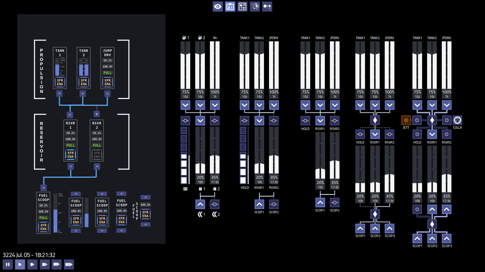
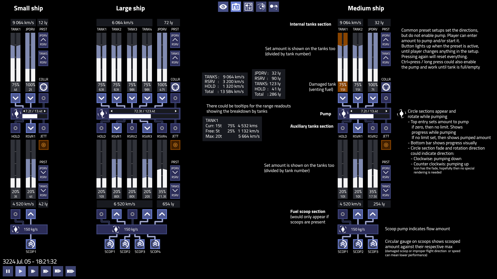

# Fuel Management

As part of the move to a hardpoint-based system, the ability to freely convert fuel in a ship's fuel tank to a unit of cargo in the cargo hold and vice versa is planned to be retired. The functionality has never been internally consistent from an in-universe perspective, as it arbitrarily creates or destroys cryogenic storage containers to hold the fuel.

The functionality is intended be replaced in several ways:

1. Ships can be equipped with "fuel reservoir" equipment. This installs in free (non-slot) equipment space, and provides additional reserve fuel storage at an appropriate mass cost. Fuel can be freely pumped up and down between the reservoir and the main fuel tank with a similar pumping interface as is currently present.

	Search and Rescue missions will require the player to transfer fuel from a reservoir tank via a docking collar or external umbilical to the stranded ship.

2. Ships can be equipped with a "Cargo Fuel Pump" equipment item. This provides the ability to transfer fuel to and from fuel containers in the cargo bay. Fuel containers can be purchased full or empty, have a credit and mass cost, and remain in the cargo bay once drained.

	A cargo fuel pump has a higher credit and mass cost than an equivalent capacity fuel reservoir, but allows the pilot to make a tradeoff between cargo and fuel on the fly without needing to reconfigure the ship's equipment setup.

3. Fuel scoops will fill the main and reservoir tanks directly, and will never create any commodity items in the hold. With a cargo fuel pump installed, the fuel scoop will fill existing fuel containers in the cargo hold as well.

4. Hyperdrives are intended to be converted to run on a separate internal fuel tank rather than consuming fuel from the cargo hold. Hydrogen-based hyperdrives can consume jump fuel from a reservoir tank (enabling fractional jump costs), and/or have an internal small-volume jump fuel tank which is refilled from the main fuel system.

5. Pre-created ship variants can trade-off fuel vs. equipment vs. cargo space in the same hull. For example, a "Sinonatrix XL" variant might sacrifice equipment space and cargo hold for an extended fuel tank.

## Fuel System Interaction

To manage the new fuel system, a new user interface section will be required. Individual cockpits might have MFD pages or physical buttons to interact with the fuel system in a specific style, but the game's interface will provide a baseline method to move fuel around the craft.

(Six different concepts for the fuel management system.)

Fuel tanks, reservoirs, and fuel-consuming / producing equipment ("fuel items") are arranged in groups called "stages", with a bus interconnect between two different stages. Each fuel item has a directional valve at its connection point to determine whether fuel flows into the item, out of the item, or does not flow at all.

Each stage interconnect has a single "transfer enable" switch/button which is used to disable the flow of fuel through that interconnect. While disabled, the user can freely configure the directional valves attached to that interconnect without worrying about unbalanced fuel flow.

Items on the bottom stage are input-only ports. This is reserved for equipment like fuel scoops which have no internal fuel tank and cannot jettison fuel. The jettison and docking collar "fuel items" are special bidirectional "ports" which destroy the fuel or transfer it to a docked ship/station respectively.

(Interaction guide for the fuel system.)

Each stage interconnect enable valve can be configured with a transfer quantity after which the transfer will automatically stop. This can be left empty for a manually-controlled transfer.

Damaged fuel tanks can potentially be indicated by a different background color, or perhaps an icon rendered over top.

Each fuel item in the system has a maximum transfer rate, and the amount of fuel flowing through an interconnect is the smaller of the sums of the source and destination fuel items' transfer rates.
