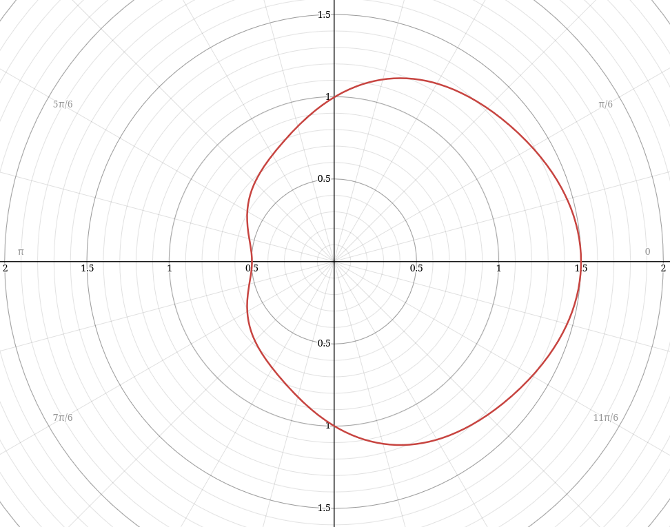

# Sensor Gameplay

Pioneer, as of 2025-08, has an exceedingly simple model for detecting spaceships and other stellar objects. It assumes that the precise position and other details of every object in the current solar system are known by the player, and limits the display of these objects to a certain radius (misleadingly named "sensor range") so as not to overwhelm the player.

In lieu of that system, a model that works on the detection ability of a ship to perceive the existence of other objects in space should be chosen. This document proposes such a replacement implementation.

## Abstract

This document proposes a mathematical foundation and high-level outline for a replacement sensor system which introduces object identity as a gameplay feature.

Ship sensors are modeled according to simplified real-world principles, allowing gameplay performance of sensors to be set by designers via realistic parameters. The introduction of a partial-knowledge model opens new gameplay opportunities for stealth and exploration, and provides additional niches for ships to fit into.
## Equipment

Ships should have one or more `sensor` slots which contain equipment that represents the primary sensors used by the ship's computer and autopilot software (if installed).

Typical sensors found as part of various ship flight control systems include:
- Proximity/Navigation sensors (infrared LIDAR for object detection and collision avoidance).
- Drive detection sensor (360° infrared camera + EM radiation detectors)
- Fire-control radar (electronically-scanned microwave radar array)
- Radar emission warning sensor (directional radio-frequency receiver)

Multiple sensors should be packaged together as a single equipment item, providing capabilities ranging from basic to advanced. Some sample equipment items are listed here, with effective ranges listed to detect an "average" ship:

- **OPLI 751S-04 Flight Control Sensor**
  LIDAR (effective range: 90km), Drive Plume Sensor (effective range: 1Mm)
- **OPLI 751S-06 High-Resolution Scanner**
  Fixed-direction infrared camera (effective range: 30Mm), planetary scanning applications.
- **Auronox WAVE-50 FCR**
  Navigation and Fire-Control Radar (effective range: 150km)
- **Auronox WAVE-50 Auxiliary Sensors**
  Radar Warning System (detects FCR tracks), Proximity Avoidance LIDAR (eff. range: 30km), Drive Plume Sensor

The goal when defining equipment items should be to present meaningful choices to the player when it comes to outfitting their ship for specific purposes. Replacing one sensor with a "better" sensor should have some sort of non-monetary downside, whether that is a lack of capabilities, increased time between detections, reduced range, increased mass/volume, etc.

The severity of the reduced capability should be reflected in the price; a sensor with only minor downsides should have a significant price tag associated with it.
## Knowledge and Tracks

A ship's computer can learn about an object in space in two specific ways:

1.  **Detection**: A sensor onboard the ship determines the position of the object by detecting some signature emitted from the object (thermal, radio emission, reflected energy, etc.).
2. **Information**: The ship's computer receives an information packet from an external source which indicates the position of an object in space. This is primarily the duty of ships' navigation transceivers, which communicate position and identity information to other ships. The ship might also receive this information from a space-based sensor installation, such as a station's STC information network.

With at least one of these types of knowledge about an object in space, the ship's computer can present a **track** to the player, indicating the presence and location of the object.

When a ship's computer has both of these types of knowledge about an object, the computer presents a **correlated track**. Correlated tracks can provide additional information about objects that the ship's onboard sensors are not able to provide.

Tracks may contain any or all of these components:
1. **Distance**: The distance of the track in space relative to the sensor is known.
2. **Direction**: The direction of the track relative to the sensor is known, but not the distance.
3. **Velocity**: The direction and speed the track is moving.
4. **Identity**: The type of object (e.g. ship, missile, etc.). This may include precisely what kind of object this is, such as the ship hull.
5. **Details**: An object's name, registration, cargo, etc.

For example, a passive sensor that detects the radar guidance signal of an active missile might generate a sensor track containing direction and identity components, but would not be able to identify the distance to the missile without data from another sensor onboard the craft. An omnidirectional smuggler's sensor might be able to detect a cargo scan and determine its distance based on the signal power, but not be able to resolve the specific direction it is coming from.

Sensors detect an object with a frequency controlled by the detection interval of the sensor. High-resolution wide-area sensors typically have a fairly long detection interval (as the sensor scans small portions of the detection area), while low-resolution sensors typically have a much lower detection interval. For sensors that "sweep" across an area, detection interval can scale with distance to the potentially-detected object.

The use of detection interval allows the computational load of sensors to be kept to a minimum, internally modelling the detection mechanism as a priority-queue of objects sorted by their next "detection attempt".

## Detection Model

Sensors can be broadly divided into two categories: active and passive. Active sensors send out a signal, and must rely on a return for detection. Passive sensors merely receive signals already emitted by the detected object.

The model for both active and passive sensors works very similarly, following the idealized [Free Space Path Loss formula](https://en.wikipedia.org/wiki/Free-space_path_loss), specifically as expressed:
$$
\frac{P_r}{P_t} = D_t D_r \left( \frac{\lambda} {4 \pi d} \right)^2
$$
Of particular interest here are the simplified [directivity](https://en.wikipedia.org/wiki/Directivity) functions $D_t(\theta)$ and $D_r(\theta)$, where $\theta$ is the zenith angle, or the angle between the signal location and the direction the signal transmitter/receiver is facing. The directivity is a unitless scalar indicating the ratio of transmitted/received power relative to an isotropic antenna which radiates the signal uniformly in all directions.

### Passive Sensors

For Pioneer's purposes, this equation can be simplified significantly, since we are interested in modelling many types of signals, not just radio waves. Using the equation for the ideal inverse-square law as applied to EM radiation:
$$
I = \frac{P}{4 \pi r^2}
$$
We can then define the ratio of signal power received to signal power transmitted as:
$$
\frac{P_r}{P_t} = D_t D_r \frac{1} {4 \pi d^2}
$$
Where $d$ is the distance between signal source and receiver, and $D_t(\theta)$ and $D_r(\theta)$ define the anisotropy of the signal source and receiver, respectively. This formula intentionally simplifies the effective area of the receiver to 1m².

For a more concrete example, we'll take a ship's drive plume being detected by a thermal sensor onboard the ship. We'll say the intensity of the drive plume signal is much stronger when observing from the the direction of the plume:
$$
D_t(\theta) = 1+0.05\cos\left(3\theta\right)\cos\left(2\theta\right)+0.45\cos\left(\theta\right)
$$
This directivity function, when graphed, results in this response:

The receiving sensor, an infrared thermal camera that is part of the ship's standard sensor suite, has an isotropic directivity function; we assume that it has a uniform sensitivity over its entire field of view.
$$
D_r(\theta) = 1
$$

With these values now defined, all that remains is to set the signal power value $P_t$ emitted by the drive plume, which can be expressed as the peak thrust energy in watts $E_t$, scaled by the current thrust percent $T_c$ and the ratio of thrust energy emitted as visible light $R_v$:
$$
P_t = E_t T_cR_v
$$

With all quantities now known, the received signal power $P_r$ can be determined and its value compared to the minimum sensitivity of the ship's sensor. If the strength is greater than the sensor's sensitivity, the ship emitting the plume is considered detected, and the sensor track is made visible to the player.

### Active Sensors 

Passive sensors are simple, but typically cannot determine distance to an object. Active sensors use information derived from reflected energy to determine both an object's direction and position.

#### RADAR

To approximate the signal power returned from an active sensor, we need to account for the additional distance $d^2$ the signal needs to travel in return, the reflective area of the target $A$ perpendicular to the signal, and the reflectivity function $R(\theta)$ of the target.
$$
\frac {P_r} {P_t} = D_t \left( \frac {A} {4 \pi d^2} \right) R D_r \left( \frac {1} {4 \pi d^2} \right)
$$

$D_t$ and $D_r$ represent the directional gain of the transmitter and receiver elements of the system, respectively, and can be constants if we model a sensor pair that is always pointing in the direction of the object.

If we simplify the equation by combining area $A$ and reflectivity $R$ into a single term representing the effective cross-section $\sigma$ (in meters) of the target in the signal wavelength of interest, the equation reduces to:
$$
\frac {P_r} {P_t} = D_t D_r \sigma \left( \frac{1} { 16 \pi^2 d^4 } \right)
$$

This equation is appropriate for transmitters which use a spherical wavefront of energy, such as RADAR or LIDAR with a point-source emitter. For sensors which use a coherent beam, such as a laser-emitter LIDAR, a different equation is required to determine the reflected energy.

#### LIDAR

The transmitter portion for a laser-based LIDAR sensor computes the received irradiance (in watts per square meter) at the target using the equation for a laser beam with power $P_t$ and total beam divergence angle $\theta$:
$$
I_t = \frac {P_t} {A_{beam}}
$$
$$
A_{beam} = \pi \left( d \tan \left( \frac {\theta} {2} \right) \right) ^2 
$$
The total energy received by the target is the smaller of the total energy of the beam and the irradiance over the cross-section area of the target perpendicular to the beam $A_{cs}$.
$$
P_R = \min \left( A_{cs}, A_{beam} \right) I_t
$$
When the beam area $A_{beam}$ is smaller than the target, the target is said to be **underfilled** and receives 100% of the energy. If the beam is larger than the target, the target is **overfilled** and some of the energy is lost.

Reflected energy functions as a point source (as in the prior equations), so the total equation for reflected energy back to the receiver is as follows:
$$
\frac {P_r} {P_t} = \left( \frac {\min \left( A_{cs}, A_{beam} \right) } { A_{beam} } \right) R \left( \frac {1} {2 \pi d^2} \right)
$$

As in the radar version of this equation, $R$ controls the reflectance of the target, determining how much energy is reflected vs. absorbed by the material. The reflection takes place over a hemisphere ($2 \pi d^2$) rather than a full sphere however, as light is reflected in a hemisphere pointing in the direction of the light vector (thus $R = 1.0$ indicates 100% reflectance).

To simplify the equation, an assumption is made that the sum of the normal vectors of the projected surface area of the target ship is parallel with the direction of the sensor. This effectively condenses the entire illuminated target area into a single point with a surface normal pointing in the direction of the sensor. As a consequence, no isotropy term is required.