# External ship-to-ship docking

## Design overview

Allowing ships to dock to each other could provide a bit of immersion, challenge and a lot of gameplay benefits by giving the player some more involved ways to work with their ships.  And it could also be implemented for orbital stations, giving variety for them too.

This page is a first stab at designing the feature, UI and my guess at what would need to be implemented for it to work. **This is merely a proposal to how it could be done, so don't hesitate to suggest changes or additions.**

## Gameplay flow

### Overview

- The player approaches the target, engage position follow mode and requests docking clearance
- Selects a docking collar (which also deploys it)
- Roughly aligns
- Switches over to docking camera for final alignment and approach
- Connects, then mission script does its thing.
- Undocks, a short bit of gentle thrust is applied away from the target (say to 3-4 m/s)

### Approach

First the player approaches the target. Ideally they stop and engage position follow mode.

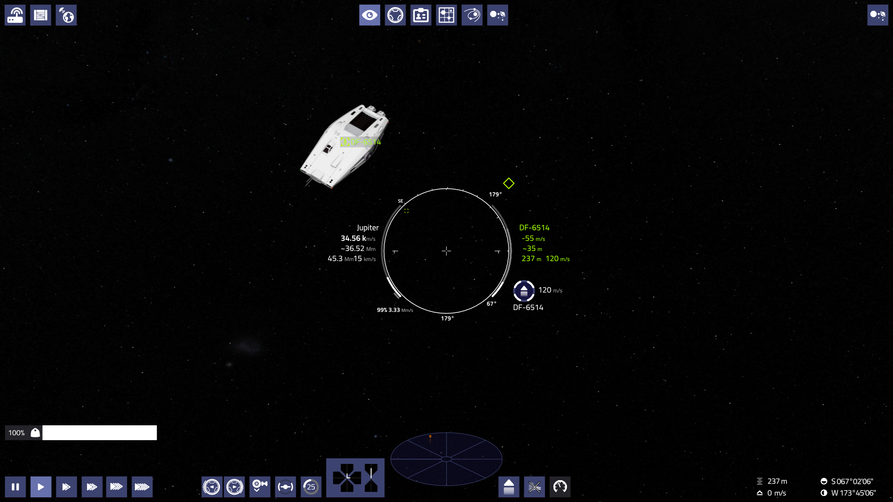

Then they request docking permission the same way as for a station:

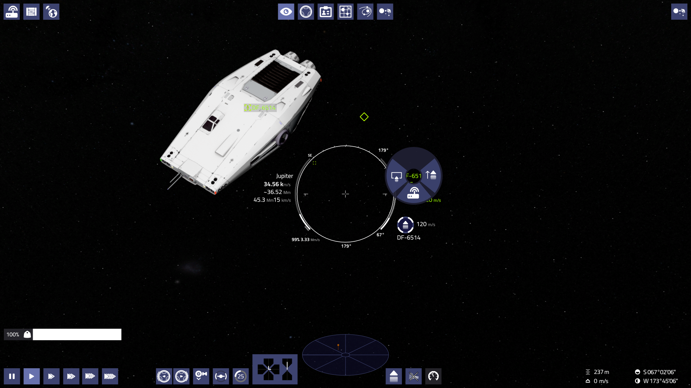

The target ship grants permission and deploys a collar and instructs the player to dock with it. Generally the closest compatible collar to the player will be deployed. The target indicator jumps to the collar, similarily to how it work with orbitals (jumping to pad).


### Rough alignment

The player then selects which docking collar they will use for docking at the bottom, next to the landing gear button. (suggested shortcust: Alt+numbers). Selecting a collar deploys it, and also brings up the rough alignment indicator. Selecting a collar limits all thrusters to the output of the weakest.

An additional indicator appears (dot with three arcs, top right) to indicate where the crosshair should point for alignment. An additional artificial horizon line indicates roll

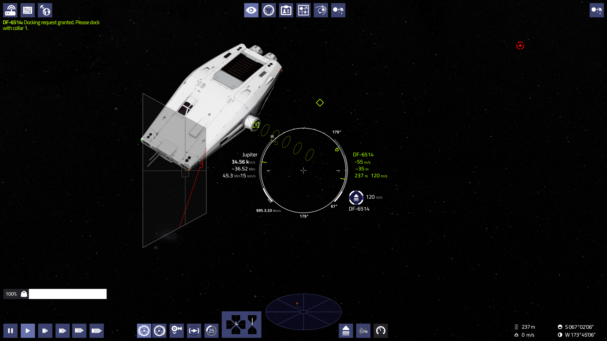

Using those indicators, the player aligns themselves with the target ship. A prograde diamond also appears on this rough alignment plane. The plane uses half the field of view than the view's, so the edges represent about 45°):

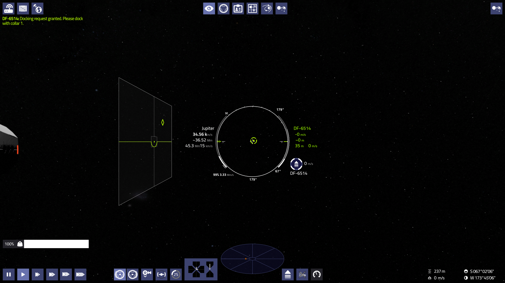

These rough alignment indicators mirror the position of the docking collar on the ship. If the ship has a collar on the front or rear of the ship, then it is placed inside the reticule. (And a similar plane could be used as a landing aid.):

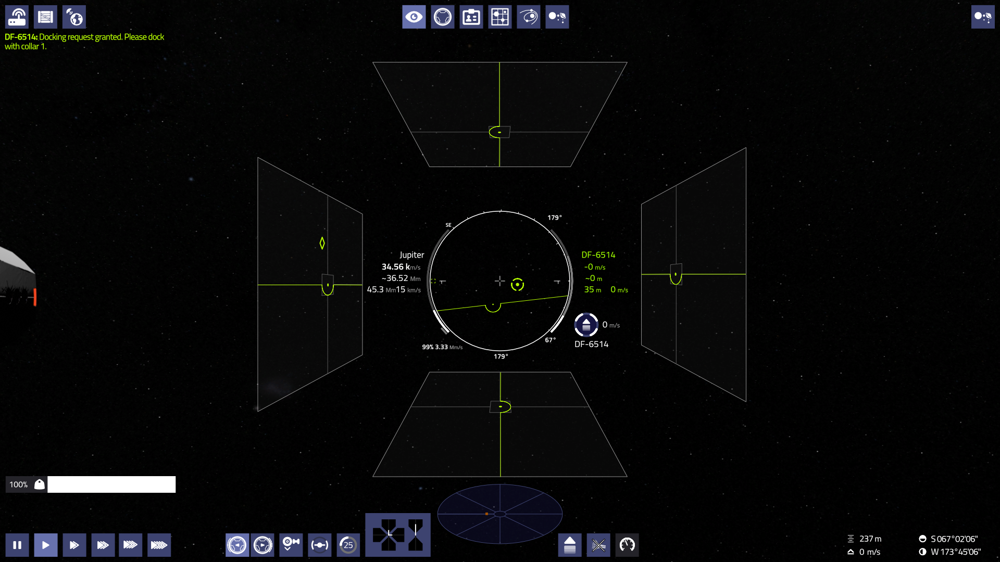

### Fine alignment

One could use these indicators for docking, albeit impreciesely. Or they can switch to the docking camera with the second button at the top row. This would switch to the camera of the selected docking port. (Suggested keyboard shortcut: alt+F1, fallback: collar1):

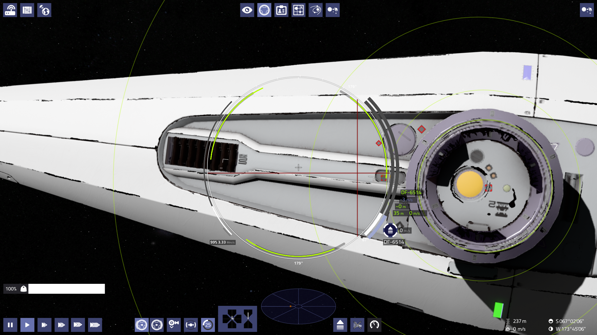

In this view, the controls and crusie control are aligned to the camera, and all accelerations are limited to the lowest value of the ship (typically side or down). 

Cruise control would use the orientation of the active docking collar when this view is active. (Similar to how it switches between vertical and horizontal based on landing gear status)

The player finishes alignment with the controls:

- The reticule is larger, and the stopping distance indicator is emphasized. 
- Everything yellow indicates data from target
- The guide ellipses seen above help with gauging movement, orientation and position
- The stop gauge works as usual
- Next to it is a distance gague (blue - color coded)
  - If empty, the ship is at the rough alignment distance (where the ellipses terminate)
  - When full, contact is made.
- Roll indicators at the edge of the reticule. 
  - The dark grays should be aligned with the yellow ones.
  - Alignments are valid at 120° increments
- Pitch and yaw cross for orientation alignment
  - 15° deviation at the edge of reticule 
  - Rotation aligned if cross is at the crosshair
  - Puts a cross at the reticule edge if deviation is bigger than 15°
- The target indicator can be used for position alignment
  - Puts a duplicate at the edge of the reticule, if it is outside do indicate direction
  - Prograde marker also puts a duplicate on it if outside

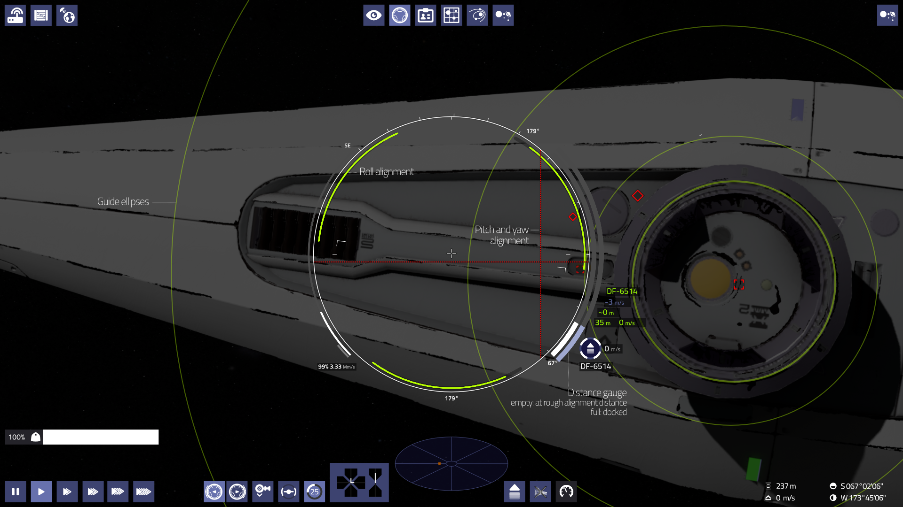

Typical workflow is to first align rotations, then position. Start a slow final approach when both are aligned.

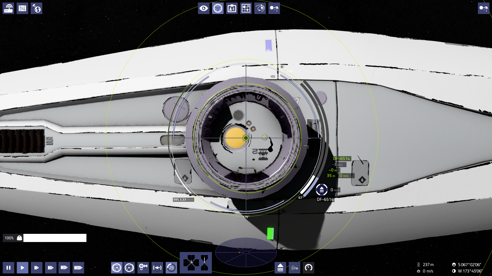

There would be a bit of safety margin for speed angle and position, before connection. The speed, distance readouts, and the position and angle indicators color would show this: red: danger, yellow: hazardous, blue: OK. 

If slightly exceeded, then the ships would still dock, but would suffer a bit of damage. If exceeded more, then they'd get damage and bounce off of each other, and the player would need to try again. This won't cancel the docking attempt, no need to request clearance again or such, but they would need to cancel any momentum and realign. (see bellow).

### Connection

If everything is OK, then the ships dock to each other.

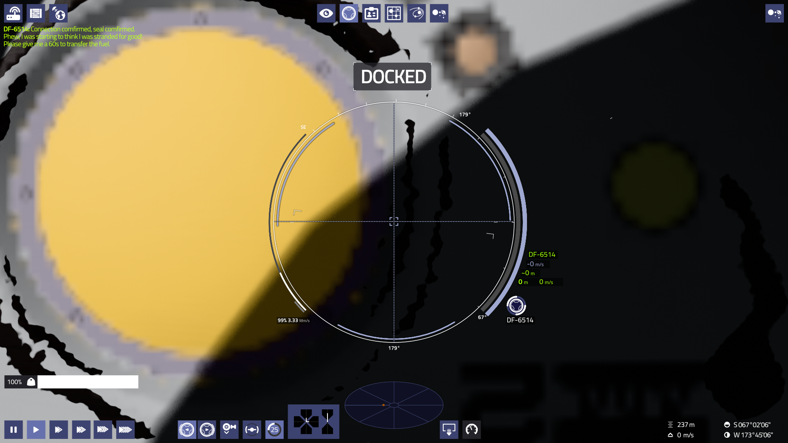

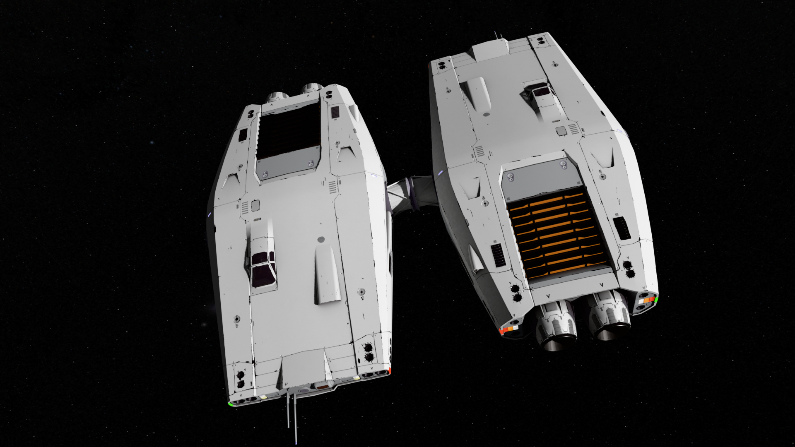

### Undocking

Cruise control button shows docking collar, and the flight mode display shows an undock button, similarly when the ship is docked to an orbital or ground station. Undocking would behave in a similar manner too: the flight computer would set a low cruise control speed, away from the target. Or better yet, gives a very gentle thrust away in manual mode, match position deactivated. Then the player would deselect the docking collar, which retracts it, and then fly away.

## Interaction possibilities

### Search and Rescue

In-orbit SAR could be the first mission utilizing docking gameplay, since it needs the least adjustments to the mission. Instead of staying within 50m of the target, the player would need to dock with the mission ship to be able to transfer fuel/crew. When transfer is completed, the player can undock. Or they can undock early, pausing the transfer, same as if they'd drift out the 50m interaction distance. 

A bit of flavor text addition would need to be done:

- Upon approach: "Hey! I'm so happy to see you! Please transmit a docking request." (since it is a new feature, a bit of call to action might be needed, so the player realizes that they can dock. "transmit a docking request" sounds a bit wooden, but points more precisely to what the player needs to do. Later on this could be changed for something less stiff when players got used to the feature)
- If the player just lingers for a while: "BD-4458, do you read me? Please submit a docking request, so the docking transponders can link up."
- Request sent: "Gladly! Deploying collar 1. Proceed with docking"
- Docked: "I was starting to think I was stranded for good. Please give me 1 minute for transfer!"
- Docked harshly: "Easy now! My ship is beat up enough already!"
- Collided: "Hey! I though you were here to help! Please attempt docking again, but be more careful."
- Transfer done: "I'm in your eternal debt! Transfer completed, I've cleared your payment. You can undock now."
- Transfer interrupted: "Hey, what happened? Please dock again so I can finish transferring the fuel! I need to get home!"
- Undocked: "Thanks again friend! If not for you, I'd be growing my beard for eternity drifting out here! Fare well!" (then flies or jumps away).

Sometimes the SAR target ships could have a bit of rotation, so docking to them would be a bit more difficult. This would also inwoke drifting a bit more. This could be random, and could depend on the nature of the emergency. Out-of fuel or breakdown situations could have some drift, medical emergencies wouldn't.

#### Distress calls

A subset of this is the ability for the player to put out distress calls if stranded (either via radio or an FTL emergency drone). Reasons for this could be broken down hyperdrives, disabled ships or depleted fuel. 

### Stations

Another obvious way of utilizing docking: there could be smaller stations that can only be docked externally. These would behave the same as large stations. They wouold have much smaller amounts of stuff available, and they could lack some services. (ie. Some wouldn't even have a market or outfitting or maintenance services, not to mention police)

#### Bulk ships

Bulk ships could use this feature too. They would act as small stations, but they don't have a permanent place, but spawned orbiting planets or next to orbital stations. They could offer stuff that's markedly different form the system economy, and could offer different prieces too. So they could be a chance to buy or sell something very favorably. 

Later on I could imagine them actually flying around places, not just statically lingering. Seeing them arrive or depart could be a sight to behold. And shuttle traffic could be generated from and to them. 

There could be on randomly generated routes, and/or there could be a list of famous ships with a timetable. So with time the player could recognize them and plan around their routes.

They could even generate missions where you'd need to source or fetch specific cargoes. In-sys taxi missions could be generated for them too and from. These missions would be more short lived than the generic ones, but would pay better.

Later this could be extended with exploration bulk ships. These would fly out into uninhabited space, and would generate missions of resupply, a lot of courier runs and cargo deliveries back to civilization. 


### Deliveries and taxi missions

These types of missions could have in-orbit destinations. 

For courier and cargo deliveries this could either be up front, or, they could reroute at the end. When you land at the destination, there'd be a chance that they had to move and left a message with the new destination. The message could also arrive when the player enters the destination system. 

For taxi missions, this could also be up-front, or the passengers could change their mind during flight. 

For both, there could be a chance of them rerouting, which could go up, the closer they are to the deadline. (Like they had relocate and couldn't wait for the delivery). This would extend the deadline, so the player isn't punished.

### Derelict looting

There could be randomly generated derelicts in systems, especially in less populated or lawless ones. The player could pick them up with their sensors if they are closer to a certain distance, and have line of sight. Then they could be docked for some random loot of cargo (and equipment later on). Sometimes they could generate optional delivery missions. For example, you find a box of farming machinery, but it turns out they were antiques en route to a museum. You could then decide to sell for their market value somewhere, or you could deliver them to their original destination in hopes of some reward (and good reputation). Or you could find the remains of the crew, and delivering them to their families could give reputation or some humble reward. (And the later could cue in some more sombre music while the remains are on board)

Apart from them being randomly placed, there could be BBS adverts selling coordinates to such ships, similarily to cargo scoop missions. They would have a timeout, and would disappear after a while, and also they could be slowly replenished as time goes. So even if you fly the same routes you could bump into one from time to time. 

Derelicts would always rotate. To look believable, they would at least need some damaged textures for the ships. Ideally, they would have damaged models too (which would also be nice for combat too later on).

### Police searches

Police scanning could also be adapted. They would first scan you, as they are now And if something suspicious turns up, they would order you to cut your engines, and submit to docking. There would be a very low chance to this if you don't have anything illegal (either Police is bored, has orders to harass random people, or they are looking for somebody/something). Having illegal cargo would elevate the chances, but there could still be a slight chance of slipping by.

They would then dock, and search your ship, which would then elevate their chances of finding your booty if you have some. (There could still be a slight chance of them not finding it). If they find anything, they would decide if they just fine you, or give you a criminal record as well, and they could also confiscate your ware. Finding low amounts of illegal stuff could only mean some reputation decrease and confiscation. 

When they are ordered to submit for a search, the player could either go along with it, fly away immedietelly or pretend they are goind with it and floor the pedal while the police ship is docking. The later if timed right could mean that the officers are a bit delayed in their response, but in both cases they would attack the player. Fleeing would always result in a reputation decrease and a criminal record.

BBS-es could have adverts about a certain system having police on high alert. In these places, the likelyhood of police patrols, and their eagerness for searching the player would be higher. This way if the player is paying attention, they could avoid these places. Especially if they are up to no good.

### Other possibilities

These could provide some gameplay without much additional UI work and restructuring. But eventually additional UI could be implemented for more varied and involved gameplay opportunities. Admittedly, most of these could work without docking, but without it, they would miss an important interaction involving and immersing the player more.

- There could be a dialog window the game and the mission modules could populate. 
  - SAR and deliveries missions could have the transfer button, so initiating it wouldn't be automatic. 
  - A trade/barter dialog could be had. The player could request docking from about any ship and trade. Sometimes NPCs could do the same, offering trade to the player. Or they could request assistance.
  - Looting derelicts could also have a similar screen, so the player could decide what to pick up. There could also be a button to investegate the ship, which then would have a chance of spawning the above mentioned missions.
- There would be a lot of text adventure/RPG opportunities in general. The [Sunless Seas/Skies](https://youtu.be/9-qt6RNxDF8?si=oBc4AiBGJ2dEcZAE&t=178) games can offer some inspiration. This would need tons of good writing, but I think it could be interesting.
  - SAR missions and deliveries could have a dialog where the player can initiate transfer, offer repairs and do some text adventure/RPG interactions
  - Police searches could have dialog opportunities too. The player could talk themselves out of a situation, or even attempt to bribe. The results could depend on commander and crew stats. (Having an intelligent smooth talking crew member could offer a bonus, but having a really dumb deckhand could ruin your chances)
  - Derelict looting could offer such text adventures too. With nice writing about skeletons in space suits. Maybe even misteries to solve, investigations to carry out. 
  - Text RPG boarding action could happen if ship disabling is ever implemented: Based on the stats of the crews, text RPG combat and could commence, with the player making decisions.

### Towing

Towing broken down ships could be another very interesting gameplay opportunity. Both for the player to tow or to be towed. But I suspect that this would require some additional thought, since the placement of the docking collars would likely be not really sufficient for this, at least from a visual point. But likely from a structural standpoint either.

For the visual overhaul, I put attachment point to all ships partly with this in mind. These could host a towing rig that then would attach to the other ships towing points. But I suspect this would need some involved shenanigans to be able to attach any ship to any other. But it might not be that complex, I don't know. At the least it would need the rig modelled to each host ship.

Alternatively, there could be special towing ships for this task with the proper attachments.

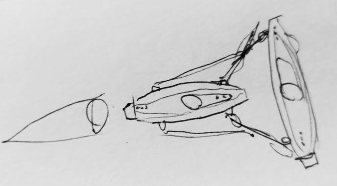

The nice thing is that for connection two ships this way, pretty much the same HUD features would be needed. The rig could be treated as an additional docking collar. Making them align to the towing points of another ship is another matter though.

## Implementation

Here I try to outline what would need to be implemented for this to work. Feel free to point out missing stuff, or things that need to be done differently!

### Flight computer

The flight computer needs to be able to maintain position and rotation relative to another one. In essence they need to be connected and move together. I believe Gliese852 already done most, of not all the groundwork.

### Docking collars

All ships would need docking collars on the model. For the overhauld OPLI ships I've already included them, and in a consistent manner. A lot of the other ships have them too, albeit their sizes and shapes are all over the place, so they would need updating.

Collars would likey be placed parallel to one of the axes of the ship. Them placed on an axis might work, but might introduce complications with the flight computer I suspect. But if not, then that's good news for flexibility in ship looks. 

#### Clearances

An important requirement for them is to be placed on the outer boundaries of the ships, so all ships could dock with any without collision. 

Some ships, like the Malabar have some collars that have limited clearances. This would mostly pose problems for the autopilot and ships spawned already docked. The player should use their head and eyes to decide if they can fit in my opinion.

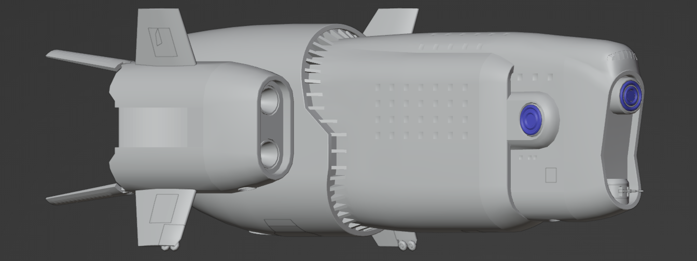

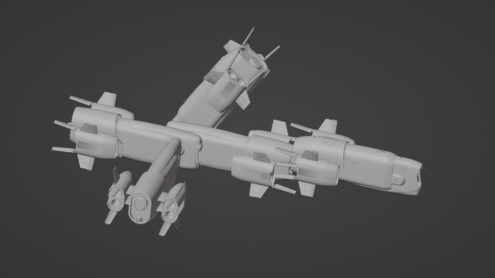

The problem is, there are orientations in which two Malabars could easily dock, and smaller ships wouldn't have a problem either. Not sure how to solve this, but maybe multiple bounding boxes for different allowed orientations? And then the autopilot would pick one it can fit in? (Ideally, the boxes would be put into a separate mesh or in the collision for easier editing). 

There could be an additional white and blacklist in the ship.jsons for known possible or impossible combinations. Like the rear collar of the Malabar So a ship could list which ships are allowed in which collars and in which orientations.

A black/whiletlist could look like this:

```json
"dock whitelist": { #this overrides bounding box checks for known valid orientation 
	"collar1": {
		"malabar": "collar1",                   # all three orientations are allowed
		"malabar": "collar2", 0, 120,           # only two orientations are allowed
		"dsminer": "collar1", 0                 # only one orientation is allowed
		},
	"collar2": {
		"malabar": "collar1", 0, 120, 240,
		"malabar": "collar2", 0
	}		
}
"dock blacklist": { #this specifically bans docking for known invalid orientations
    "collar2": {
    	"dsminer": "collar1",         #barred from that collar
    	"dsminer": "collar2", 120,    #barred from one orientation of that collar
    }
}
```

For each ship the lists would be checked, and any prohibited entries would be disregarded. Erring on the safe side (when one says its OK, but the other says it is not, then don't allow that combination. 

Another reason this needs to be addressed is that orbital stations could have more elaborate structures, gantries and such. Like an extended docking "tower" could easily reach between the radiator fins of the Malabar, and a black/whitelist entry could solve that.

Ship designers would be responsible to start these lists. Ideally the ship editor could be used to attach any ship to any collar to easily check these. 

##### Alignment distances

The rough alignment distance the ship would mark for the other, and the autopilot would use should be at least the size of the larger ship in the given dimension. So there would be at least a ships worth of room between them. 

#### Collar sizes and shapes

Collars could be standardized to ensure compatibility between ships. Currently the OPLI ships have three sizes of collars:

- Xylophis: 1xS1
- Coronatrix: 1xS2
- Sinonatrix: 2xS2
- Natrix (wip):  1xS2 2xS3


These were made in a way to ensure compatibility: S1 can fit to the inside of S2, and S2 can fit in the inside of S3 if the petals are retracted. In general all collar sized should be done in a way that they can accept one size above and bellow.

And S3 could have a turncated cone in the center to accept S1. Larger than S3 collars could have two versions: an universal one that can accept every size, and a generic one that can connect one size up and down.

Ship designers then could pick to put universal collars on their models in different sizes, or universal ones:

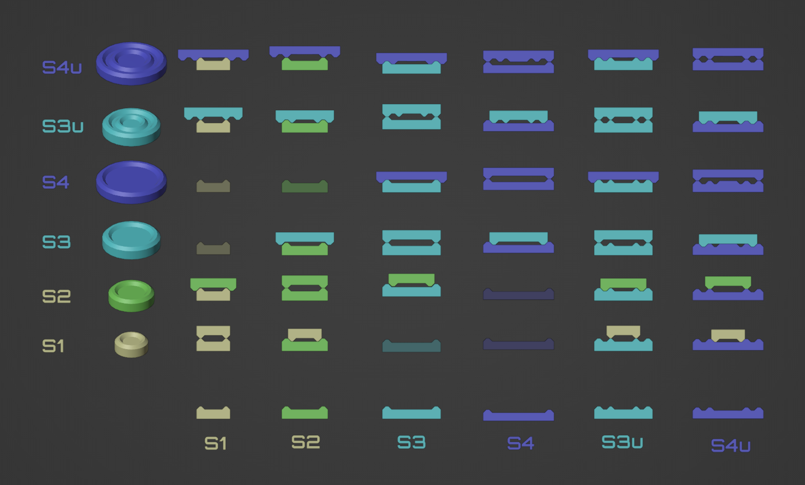

The nice thing is that collars of the same size, the petals guide them into each other, but for mismatched size, the iner and outter tapering of the collars do the same. 

I suspect having an S2 for S1&S3 compatibility and an S4 on larges hips would be sufficent, and would offer more visual variety. 

Likely there's only need for S4 on the larger size. An S0 might also be needed for very small ships, like the Varada, but that might then only be able to connect to S1s.  

##### Fallback

For ships that lack docking collars, (mods for example) the landing tag could be a good fallback tag. Any sized collar would be able dock with it, and it should offer enough clearance by nature. 

#### Collar deployment

The player can select which collar to deploy similarily to raising or lowering the landing gear. For the first iteration, only one collar could be deployed at any time, so deploying another would retract the previous. There would be a button for each collar, indicating it's direction at the bottom left:

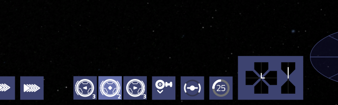

On the above example the ship has three collars: one S3 on each side, and one S2 on the front, and the top one is deployed.  They are ordered by how the tags are numbered, from left to right. The number indicates collar size, and the little symbols in the center and the circles around it indicate direction and occupancy:

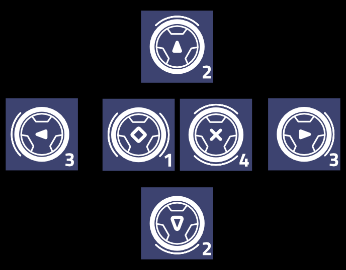

Likely playable ships won't have more than 4 collars. On a HD screen, there's toom for three in that place on the HUD, but having four or more might require some reshuffling of the UI.

NPC ships would decide which collar to deploy, upon request:

- Always preferring the largest matching, or largest compatible 
- By which is facing towards the player the most (not sure how hard it is to implement)
- Either randomly (i guess it is easier to implement)
- Even if it is based on direction, there could be a small randomness ("I store my plants in airlock #1, so go to #2")

##### Landing gear

Landing gear and collars should be exclusive to avoid any clearance issues. Deploying a collar would retract the landing gear and vice versa.

##### Navlights

Navlights should be turned on too, if any collar is deployed. There could even be lights specific to each collar. 

##### Keyboard shorctus

I think by default ```alt + numbers``` could be the keyboard shortcuts for toggling collars. ie: ```alt+1```

##### Docking multiple ships

Large ships and bulkships would surely benefit from being able to be docked with other ships. Smaller ships could use that too, but might be less necessary. For this each collar should be able to deploy independently, and the player should be able to undock selectively:

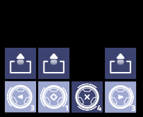

#### Collar camera

Collars would have cameras, at the position of the inner docking tag. An additional docking camera button would be placed next to the view switch. Suggested  This button would always switch to the deployed collar (switching collars would switch the view as well). RMB on the collar button could also switch to the camera of the collar.

Switching to this camera would also switch to a larger docking reticule which would only show the relevant information (see above). In this view accelerations in all directions would be capped to the least strong value (typically sideways or up), and controls and flight computer would orient themselves with the camera. (so W goes camera forward). The player could either use cruise control or manual flight. 

##### Keyboard shortcut

Either ```alt+F1``` or ```F2``` could work, but for the later, the other keys would need to be shifted. Which might be beneficial: their F number could consistently correspond to their place in that row, so F1 - view, F2 - docking camera, F3 - info, F4 - comms, F5 - sector map, F6 - sys map, F7 system overview. The hyperdrive could either be a remappable key, or shifted to F8. 

If multiple ships could dock, then the view button would cycle between the deployed collars, and RMB on the collar buttons would switch to the camera of that collar. The collar view key and button could cyle through the deployed collars. 

#### Animation

Collars would need to be able to deploy, extend from the hull a bit, to ensure that clearance.


This could be done with a very nice hydraulics rig, which could also offer some buffer for harsh dockings:


The nice thing is that this rig can offer 6 degrees of freedom, which could open up possibilities to some slight margins of error by them trying to compensate for small deviations from the proper alignment. (If anybody wants to open the can of worms ofimplementing rigging for that in-game)

Each collar would need a separate animation. 

A potential issue can be that some ships have articulated parts that would be in the way of docking, and would need to be folded away same as when landing. But each node can only be controlled by one animation. Maybe detach the tucking away and landing gear animations? And the ship.json could define which collar or the landing gear needs these additional animations triggered.

#### Petals

Petals are there to guide the collars into each other gently. They aren't required per se, but they are a very nice small detail to have, so I'd really  prefer having them. The problem is that they are in the way when different size collars dock, so they need to be retractable. I think they could be animated for that. And I suspect they shouldn't have collision meshes anyway. 

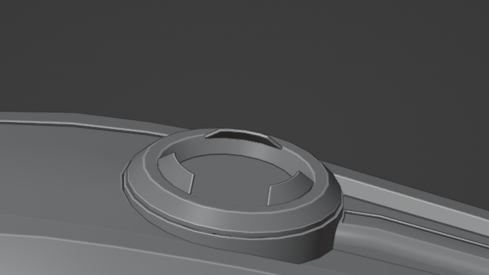

Their retraction could be governed by which collar is active on the docking ship. If they are the same class, then the animation would only play the extension range. If they are an odd-even pair, then the rest of the animation would play (retraction). And in the opposite direction too: if the player swithces to another collar, then the petals on the both ships would follow. 

Another caveat to petals is that they limit possible roll alignments to 120° or 90° increments. I think that's a good thing, since you'd need to line up the connecting latches and buses anyway realistically. Right now I've put 4 petals on the S3 collar, but I can change that to three if that makes things easier..

#### Tags

There only needs to be two tags per collar to accommodate the different sizes:

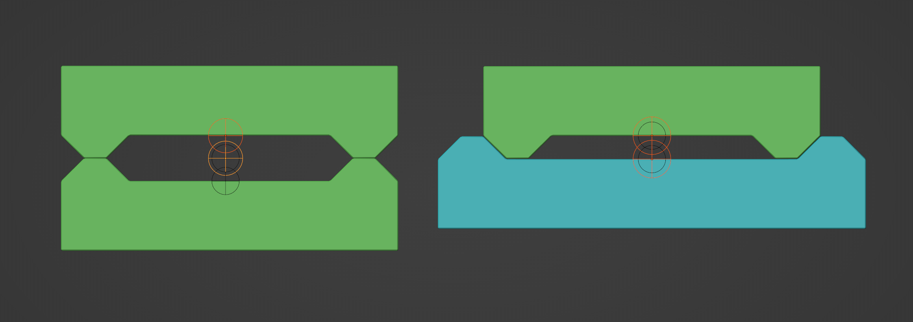

##### Size numbering:

The size numbering even helps with this too: 

- If sizes are both odd or even, then the outter ones would connect.  
- Odd to even/ even to odd: outter connects to inner 

Or this could even be simplified further, since all collars have the same depth: only have one tag at the outter plane, and if an even-odd situation occurs, then offset the connection point inwards with that depth. 

##### Tag naming 

Tag naming could look like this: ```tag_collar_N_S1_A```

- N: collar number. There could be a convention on how to number them. Say from left clockwise to front and top and so on. 
  - This could also be a letter, or letter combination, like "Collar FL" if we want more clarity
- S1: size class, from S1 to S4
- A: A or B: determines if it is the outter or inner tag of the same collar. 

For example, these would be the two tags of the same collar:  ```tag_collar_1_S1_A``` , ```tag_collar_1_S1_B``` 

##### Tag orientation

Tag orientation would be the same as with camera and gun tags: Z out, X left, Y up:

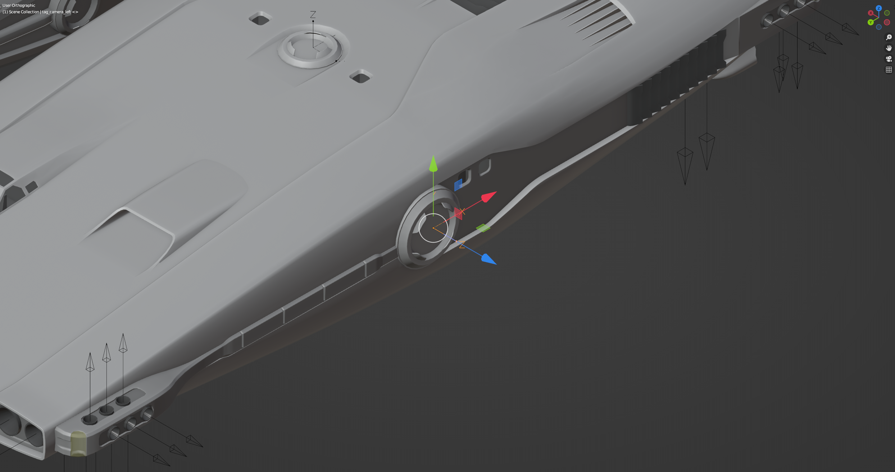

Ships would align their tags on the same axes, but with flipped X. 

##### Tag animations

For the first iteration, having the tags at the plane where the collar extends to should be enouh. 

But if we later want derelicts, and situations where the player docks without a request (derelicts, boarding), then there needs to be a way to tag the retracted collar state too. Either tags should be able to be moved with the extension animations, or there should be a set of tags for both the retracted and extended stat.

**Or we ignore this**, and derelicts have tags at the retracted position, and for boarding, we ignore the problem: collars are required to respond to requests by law)

### Docking capture

I think there shouldn't be collision volumes involved in the detection of capture. To me it seems simpler and less prone to error if distance from tag is measured to decide if connection is made. If the tags are closer than the depth of the inner tapering (about 30cm), ship controls should be disables, and a small snapping attraction could be applied. This way there could be a bit of leeway for the player, and also the funneling nature of the petals/collars could be imitated without worrying about collisions. 

#### Safety

If speed, positional or angular alignment isn't perfect at this final point, then there would be consequences. The indicators would change color to indicate this safety:


The speed readout and the distance gauge shows speed safety (not just approach, but relative speed):

- Blue: OK Ship would dock without issue (bellow 5m/s) 
- Yellow! : Hazardous. Ships might damaged, but still dock (between 5-10 m/s)
- Blinking red + ! : Dangerous. Ships would bounce off of each other, and get some damage. (above 10m/s)

Rotation also needs to be aligned for docking with a couple of degrees of tolerance:

- Blue: OK. Dock without issue (1-3°), 
- Yellow: Hazardous. Ships might damaged, but still snap into a docking orientation (3-6°)
- Red blinking: Dangerous. Ships would bounce off of each other, and get some damage. (above 6°)
- for roll 120° or 90° increments could be allowed

Position tolerances are indicated by the color of the target indicator (horizontal and vertical axis):

- Blue: OK. Dock without issue (0-20 cm)
- Yellow: Hazardous. Ships might damaged, but still snap into a docking orientation (20-40cm)
- Red, blinking: Dangerous. Ships would bounce off of each other, and get some damage. (above 40cm)

**These values are subject to testing, might be too forgiving, might be too harsh. Possibly there could be a docking difficulity slider in the settings even.**

### Undocking

Undocking would work similarily to how undocking form stations currently work. An undock button would be at the bottom. Pressing it would detach the ships, and would input a small thrust to each ship, in the away direction from each other (the proper amount might require some testing). Flight controls are reenabled, and the player is free to do anything. 

NPC ships would wait for a bit and would then start applying more thrust away until they get at least two or three ship radii away, before doing any maneuvering. For stations, there could be waypoints too. 

I think just applying a bit of thrust would be better than inputting a set cruise speed away. 

### Autopilot

The autopilot would likely need to know about it. Both for the sake of players who don't want to engage with such gameplay, and for NPC ships docking both with other NPC ships or the player. 

- Externally docked stations would need to work with NPCs.
- Police for example would want to dock themsleves for search, instead of instructing the player to dock.

- Players with large ships would likely prefer to request other ships to dock to them instead of them docking to a smaller one for trading and such.

- The player (or any other ship) could get disabled (engine failure, empty tanks), and a SAR ship then would need to be able to dock with them.

- Pirates could attempt to dock disabled ships, both NPC and player.

- Derelicts could attract NPCs too, potentially beating the player to the loot. Or shooting at the player to shoo them away, and then attempt to dock. 

