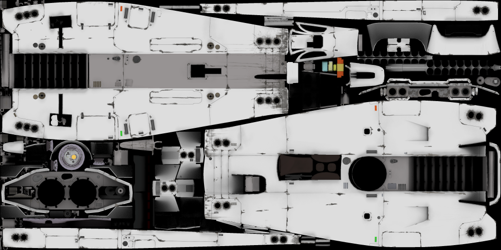

# 3D asset workflow

This article goes over the steps to create a 3D asset for Pioneer. A lot of it is generally applicable for any 3D art, but some parts are specific to the game. One important aspect of this workflow is that it allows for constant discussion along the way, and iteration based on that discussion. If one feels stuck, asking the others on IRC can provide valuable insight or even technical help. It also facilitates collaboration as well, since there are clear points where the work can be handed over to another artist along the way. For example if somebody does not trust their texturing skills, then they could hand over the final UV-ed model to a texture artist, who then passes it over for someone knowledgeable with the model system for final setup.

## Sketching and ideation

The first step is coming up with the idea for a model, be it a ship, a station, building or anything else. Sometimes there is a brief available, sometimes we are working from scratch. In both cases it is useful to first sketch out the idea and turn it into a proper concept. 

This can happen on paper or in a drawing app, or even in 3D, but the aim is to figure and iterate out the design as clearly as possible. The main reason we want to do this is to be able to discuss the design with the team, and to spot and solve any design issue early on, when it is easier to adjust than on a half done, or even textured model.

Apart from this, the sketching process facilitates the development and maturing of the design in question, so it can become its best version.

### Reference gathering

We rarely , if ever start from nothing, when we are designing something. That would be a good way to create a bland or unrelatable design. But it does not mean that we gather up designs from other creators and mash them together (not saying that their work isn't worth studying, mind you). Rather we first go to the real world and gather inspirations from there. Cars, ships, trains, tractors and of course planes and spacecraft are a good starting point, since we are aiming for believability. 

Of course we are not strictly beholden to reality, but let's try and keep things at least a bit grounded. This adds a lot of believability too. 

### Thumbnailing

After, or in parallel to reference gathering we start to thumbnail out the first jabs at the design. Meaning we are doing small simple and loose sketches first. This is important, because this way we don't get ahead of ourselves, fall in live with the first half-decent idea and run with it to later realize that it is not working or not interesting. First we try out as many variations and versions as possible, and then look over all of them and choose the best one as a starting point. Of course the best one could easily be a mashup of several of the thumbnails in the end. 

Some suggest that it is a good idea to do several rounds of thumbnails:

- Very strict ones, that are close to the reference material. You could even do studies at first to figure out what makes them tick
- Looser, more playful ones. They might even go a little bit off-brief
- Very loose ones. The aim is to loosen up and try as many and as wild ideas as possible, to explore as much as we can

Ten to twenty of each round should be a good amount to start off from.

This process is really akin to exploration. We haven't yet committed to anything, just exploring the possibilities that are in the idea. We let it flourish.

### Sketching, concept art

When we feel that the design is starting to take shape, we can go in and start working on more elaborate sketches. These can also be drawings, but I usually do a quick 3D blockout at this stage as well, to see the idea in 3D. If you do take the 3D route, remember, that nothing fancy should be done at this stage. The model should be a bunch of relatively simple shapes or even primitives. Don't get hung up on details or clean modeling. The aim is to have a quick and dirty, easily modifiable model. Which we can even screengrab out, and draw over it, so we don't have to nail the exact shapes and details or proportions over and over again. And we have to worry less about perspective that way as well.

## Modeling

When the concept design is ready, we can start working on the model. (Finaly!). You can even export and preview your model n-game at about any point during modeling or texturing. But you'd likely want to check out the Setup section for that, especially the tags, model and ship setup parts.

### Blockout

The first step is to do a rough blockout, if you didn't do one already. Anyhow, we start to figure out the shape of the model and iterate it towards more detail as we go. At this stage don't worry about clean modeling or topology much yet. Feel free to use booleans and intersecting geometry, or (blasphemy!) triangles. The aim is to dial in the shape language and proportions of the design, before committing to the clean model.

Sometimes things aren't seem to work out at this stage, and the design is not working. It is no reason do despair if that happens, and this is why we were being loose and rough. We could easily go back to the sketching, or even the thumbnailing phase to figure it out. One could even make some screenshots, and draw over those.

#### Cleanup

When we are satisfied with the blockout, we can either remodel it, or clean up the rough model to a final polished state. There are several aims with any model for Pioneer:

- Relatively clean topology that supports the intended shape. Ideally with quads where possible, but it is not a strict requirement. But only use triangles where needed, to keep the model as easily modifiable as possible.
  - Try to avoid overly long and distorted quads and triangle
  - Watch for shading issues (although some of those can be hidden by the texture)
- Mid poly game polycounts. Depending on the size of the model, and the intended viewing distance, there are some rough tri count limits to adhere to:
  - S1: 20-40k tris (Xylophis, Coronatrix)
  - S2: 40-60k tris (Sinonatrix)
  - S3: 60-160k tris (Natrix)
  - S4: 160k-300k tris (no example yet)
- It is useful to use Mirror and Subsurface modifiers, but in the end you will likely need to apply them.
  - In some cases, Mirrors can be kept, since they allow for UV mirroring and offsetting.
  - Subsurface might be kept, depending on how the UVs work.
- Booleans are need to be applied and cleaned up. If the boolean-ed parts have UVs, those are transferred upon application.
- Bevels are usually can be kept, especially if they are small. Larger bevels and chamfers are likely be better to be applied, so the UVs work correctly. 

### Animation

There are several animations that might need to be done. For ships you would at least need landing gear deployment, also there's an idle channel available (for spin sections for example). In the future there might be other animations required, like docking collar deployment, or for a landed state.

Pioneer can only do linear interpolation between keyframes, so easing animations need to be baked. 

For rotations, the euler order is XYZ. If you don't know what that means, then likely you don't need to worry about it, since you have to specifically switch the order if you want to use any other. Quaternions are not supported.

Constraints and parenting aren't supported either, so if you are using such, then you also need to bake the animation. Sometimes this can be finicky, especially if you also mirrored parts. (Which can also flip normals when baked)

### UV unwrapping

Before we start texturing, we need to unwrap the model, so the engine knows where each pixel of the texture goes on the model. But don't start this before the model is done, because changing the model can mess up the UVs sometimes. 

For small parts, like lading gears, sensors and such UV space can be reused by overlapping islands. But larger parts and surfaces should have their own UV space to avoid obvious mirroring patterns. And to ensure proper AO and texture baking. 

The mirror modifier can be set to mirror the UVs too, and even the mirroring line can be offset too, allowing us to keep the mirror in place. Useful for not doing double work wherever possible.

The UV space should be set up in a way that at least somewhat mirrors the shape and structure of the ship, to support pattern creation as much as possible:

This does not need to be overly strict, but the main shapes of the sip should clearly be identifiable. If we skimp on this, then patterns could only be feasibly created in a 3D painting program, and that can be a lot of hassle to make them clean that way. Also not every contributor uses such software, so don't make their life harder.

## Texturing

## Setup

### Tags

Tags are used to identify specific parts of the ships, such as engine exhausts, cameras, landing points, weapons, etc. These specifically named empties. Some of them can be scales, some of them should be kept at 1,1,1 scale (especially cameras!)

### LoD-ing

Aka Level of Detail. These are additional lower polycount models that are displayed at specific distances, so the GPU has to do less work. Most models should at least have two levels, a high and low detail one. All ships should have at least three:

- High detail - this is what you modeled so far
- Medium detail - tri count is about the third of high
- Low detail - tri count is at least half, but ideally about third of medium

The nice thing is that most of the tools one would use for this (removing edge loops, dissolving vertices) do not mess up the UVs, if we don't to them on the seams. Which means that it is relatively straightforward and fast to LoD a model. A couple of hours at most for a Natrix sized ship for example.

### Collision mesh

We also need to create an even lighter mesh for collision detection. I usually make it from the low detail LoD. Fortunatelly it does not need to be pretty, but there are some things to keep in mind:

- They should be mostly convex. So small gaps and holes shouldn't be there
- Ideally they are manifold, meaning there are no holes, missing faces
- There can be intersecting meshes
- For landing detection there needs to be a small downward protruding bit, ideally placed at the landing tag.