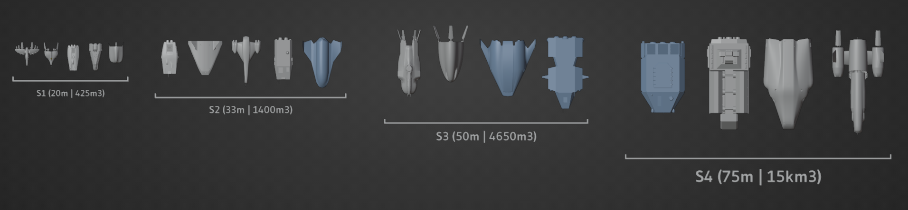

# Ship size and role classification
## Ship size classes
- Starting with S1 ships, the maximum hull volume of a ship class scales by a factor of 3.3.
- The smallest ship in a size class should have no less than 1/2.5 the volume of the largest ship, though this applies more to new ships than existing ships.
- For S1-S5 ships, the maximum length defines a bounding box with aspect ratio divisors of `1:1.2:1.6` Length:Width:Height that ships must fit into. (e.g. S1 ships must fit into a 20m x 16.6m x 12.5m bounding box, and hangars for S1 ships must provide at least that much space.)

This yields the following breakdown of ship size classes:
- **S0**: maximum of 10m in length and 80m3 hull volume. S0 ships are snubs / shuttles (the space equivalent of cruiser bikes) and are generally incapable of mounting a hyperdrive. The bounding box for S0 ships is directly 10m x 6m x 5.5m, and it defines the size of a shuttle bay (330m3 equipment volume required).
  - It is recommended that S0 ships do not fully occupy the bounding box in any dimension, for easier docking.
- **S1**: maximum of 20m in length or 425m3 hull volume. The minivan or SUV of the ship world, these ships are quite specialized and generally characterized by high agility, low price, and low endurance. One person could live in it, but it would be very uncomfortable and cramped. Provides all the living space of a small tent with nowhere to leave.
   - **Ships:** Pumpkinseed, Bowfin, Coronatrix, Lunar Shuttle, Mola Mola.
- **S2**: maximum of 33m in length or 1400m3 hull volume. These are closer to a large passenger van or tractor-trailer, with true multirole offerings available. Lower agility is made up for with higher capacity and endurance. 1-2 crew could live in it, but regular stops planetside are a must. Equivalent to a tiny apartment.
   - **Ships:** Wave, Sinonatrix, Skipjack, Natrix, Deneb.
- **S3**: maximum of 50m in length or 4650m3 hull volume. Comparable to a business jet or a boat with good endurance for a small crew. Specialized offerings available, but most ships are able to perform civilian multirole tasks. Depending on endurance, the hab space could be relatively roomy.
   - **Ships:** Bluenose, Mola Ramsayi, AC33/Venturestar, Storeria.
- **S4**: maximum of 75m in length or 15,000m3 hull volume. Long-haul ships at the upper edge of still being able to land on planets. Typically, these ships can mount an optional shuttle bay for S0 shuttles. 
  - **Ships:** Nerodia, DSMiner, Lodos, Malabar.
- **S5**: maximum of 110m in length or 50,500m3 hull volume. Large sub-capital ships restricted to docking externally at spacestations. These are the largest which can still be considered to be "piloted" by the player rather than being part of a fleet element.
  - **Ships:** none currently exist. Bluestreak is planned for this class.
- **S6**: Bulk ships which must be commanded via fleet interface rather than directly piloted. Required to have at least a S0 shuttle bay, may have fighter bays for S1 ships or docks for larger ships. Larger ships in this size class are incapable of docking at stations and must rely on cargo haulers to move goods or external shipping containers around.

Pioneer's current ships fall between S1 and S4 (some shuttles not pictured) as shown:

### Lading/docking bay sizes of stations
Pad size = visual size (circles on the pad for example)
Allowed: how big ship the station currently allows onto that pad
Max: the biggest we could get away with on the model
| Pad | Pad Size | Allowed | Max |
|---|---|---|---|
| Octagonal S1 | 26m | 0-20m | 36m |
| Octagonal S2 | 51m | 20-500m | 75m |
| Six-pad | 116*209m | 0-100m | 101*182m |
| Orbital S1 | 23m/26*49m | 0-33m | 27*36m |
| Orbital S2 | 55m | 0-50m | 50*60m |
| Orbital S3 | 106*140m | 0-100m | 106*140m |

## Ship roles
See the design document for more elaborate explanation
- **Utility** - Utility and maintenance ships. Typically low deltaV. Including container tugs. More for background stuff than for the player. Might become more useful when bring-along ships are implemented.
- **Shuttle** - short range ships, not intended for long trips or inter-system travel. Small tanks, low deltaV, usually mediocre thrust. Usually don't have accommodations for longer trips. Simpler built, easier and cheaper to operate, but quite limited. They can also be brought along by larger ships. Sometimes they use the same chassis than a transport or freighter
   - Cargo shuttle: for moving cargo between locations. Cargo tugs might be in this class instead.
   - Passenger shuttle: for short range travels. Akin to a passenger plane or train, so not much accommodations apart from seating.
- **Transport** - long-range ships, usually capable of inter-system travel (but not necessarily). Medium to high  deltaV, average thrust. Have accommodations for longer trips: larger crew compartments. More complex, harder and more expensive to maintain, but more versatile. Sometimes they share components or chassis with freighters
   - Cargo transport: for moving cargo between planets and systems.
   - Passenger transport: for long range travels. Proper accommodations, like cabins, communal spaces, galley etc.
- **Multirole** - Versatile platforms that can be modified to specific needs. This can include cargo and passenger hauling, surveying, servicing, mining, combat, etc. Usually not as good as purpose built ships, but are more versatile and easily converted.
- **Explorer** - Intended for long duration expeditions. Typically high deltaV, with the ability to refill tanks. Good hyperspace range. Good crew accommodations and cargo space to aid long endurance trips. Has extensive sensor arrays and other equipment.
- **Courier** - Designed to get small amounts of goods or information packets to a far-away place fast. High deltaV, high endurance, but smaller cargo space and minimal crew complement.
   - Combat courier: high-speed military ship with an eye for long-range engagements. Generally less armed and armored than a dedicated fighter, but a focus on sensors, fuel capacity, and ECM/ECCM gives this ship a battlefield niche.
   - Light courier: a design prioritizing hyperdrive capability, long-range listening sensors, and defensive signature damping yields a very effective class of spy ships and hyperspace couriers. Typically carries digital packets and small physical packages, with very little cargo space.
- **Combat** - Intended for fighting, attacking and defending. Not much elaboration yet, because combat ships on their own can have quite a few roles and uses, but this is less relevant for civilian uses. Usually distinct chassis. Sometimes courier chassis can have a combat variant.
- **Mining and prospecting** - ships intended for asteroid and gas giant mining. Distinct chassis usually, or a *heavily modified* freighter.
